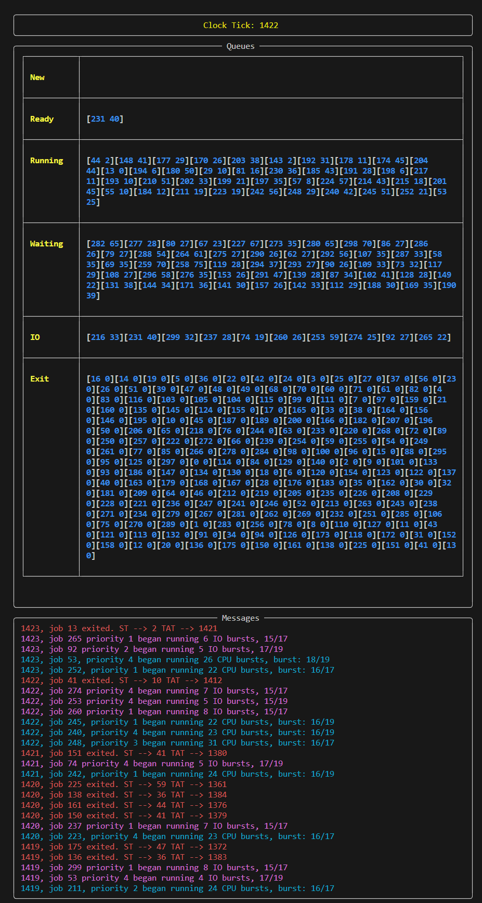

# CPU Scheduling Simulation

## Overview

**CPU Scheduling Simulation** is a command-line-based tool designed to showcase various CPU scheduling algorithms. This simulation allows you to explore and understand the behavior of scheduling algorithms like First Come First Serve (FCFS), Round Robin (RR), and Priority-Based (PB) on Process Control Blocks in a CPU.

### Installation

Before running the simulation, make sure you have the required packages installed:

```bash
pip install -r requirements.txt
```

### Usage

Once the necessary packages are installed, you can execute the simulation with the following command:

```bash
python sim.py test_data/IOS.dat --cpus 2 --ios 2 --sched="FCFS" --speed=0.1
```


### Example Run of simulation



## Getting Started

For sample input files and data, please explore the `/test_data` directory. You'll find various test cases, including CPU-intensive and I/O-intensive scenarios. Refer to `examples.md` for guidance on testing and running simulations using `sim.py`.


### Command Line Arguments

Here's an explanation of the available command-line arguments:

- **ios**: The number of I/O devices that can handle I/O bursts for the processes.

- **cpus**: The number of CPU "cores" capable of handling various processes simultaneously.

- **sched**: The scheduling algorithm type to run the simulation with. It must be one of the following: ["FCFS", "RR", "PB"] (First Come First Serve, Round Robin, Priority-Based).

- **speed**: The amount of time to pass between each clock tick within the simulation. For example, setting it to 0.001 will result in 1000 clock ticks per second, provided your system has sufficient processing power.

- **time_slice**: Applicable only for the RR (Round Robin) scheduling algorithm. You can customize this value to determine how much time each process is given from the available processing resources (I/O and CPU devices).

- **csv_file**: The name of the saved CSV file that contains statistics generated during the simulation. This allows you to compare runs from different algorithms in CSV format. See /test_data/FCFS_CPU_HEAVY_LARGE.csv


## Project Components

### [sim.py](sim.py)

A command-line tool that launches the scheduler based on the input parameters and displays the simulation. For usage details, run:

```bash
python sim.py --help
```

### [walkthrough.py](walkthrough.py)

Walks you through various commands for the simulation. run:

```bash
python walkthrough.py
```

and then keep clicking enter after each simulation. This program should show you a good range of use cases and provide a lot more clarity behind what is actually going on in this repo. 

### [scheduler.py](scheduler.py)

This module handles all scheduling algorithms and the swapping of processes between the new, ready, running, waiting, IO, and exited queues. Currently, it implements Round Robin, FCFS, and Priority-Based scheduling algorithms. It also features auto-switching, ensuring that processes don't spend unnecessary time in the waiting/ready queue if there are available I/O or CPU resources. All logic resides in the Scheduler class.

### [sim_viewer.py](sim_viewer.py)

An abstraction layer responsible for utilizing the `rich` library and managing its usage within the simulation. This component also implements functions to load the screen and display the final output from the simulation.

### [pcb.py](pcb.py)

The Process Control Block (PCB) is the primary object displayed in the simulation, representing the processes' vital information.

### [generate_input.py](generate_input.py)

Use this tool to create additional test data for use in `sim.py`. It's a command-line tool, so you can generate test data easily by running:

```bash
python generate_input.py --help
```

You can define various parameters, such as CPU/IO burst ranges, the number of processes in the file, and the total bursts for each process. Again, the --help is going to get you what you need to generate more data. 

## System Requirements

This project was built using Python 3.11 and relies on the `rich` library for visualization. Should be reverse compatible with most Python 3 version. But this could definitely be an error in some cases. 
